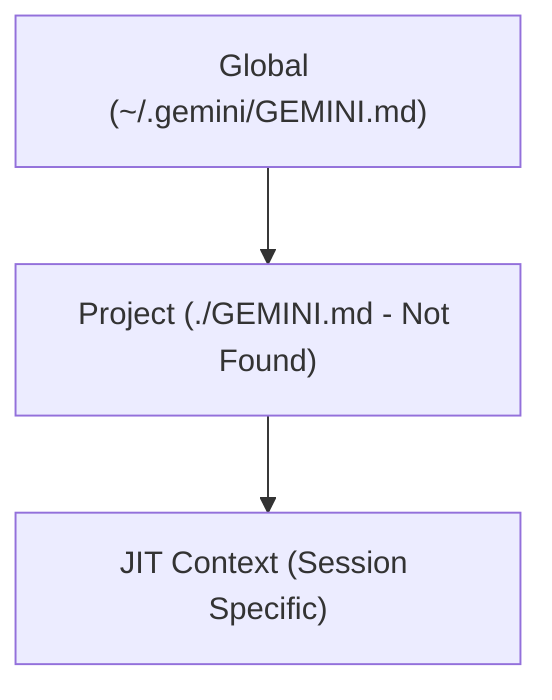
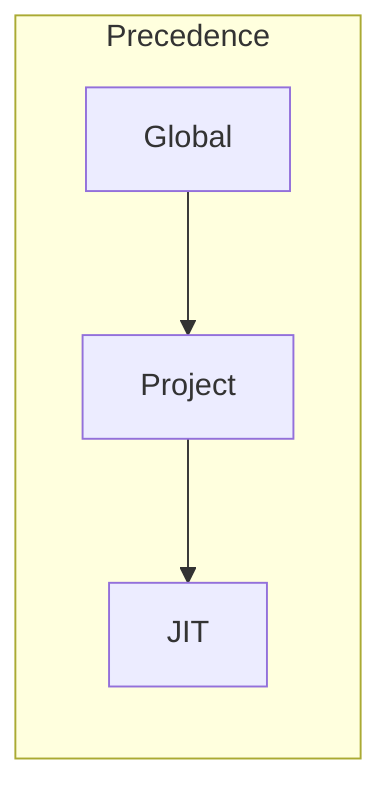

# Directives

This file documents the active directives for this project, including global, project-specific, and JIT contexts.

## Visual Progression

### Context Hierarchy

### Inheritance and Precedence

## Tree View of Loaded Context Files
- **Global:** `/home/rwolf/.gemini/GEMINI.md`
- **Project:** (None found)

## Active Directives

### Global Directives (from `~/.gemini/GEMINI.md`)

#### Auto-Documentation
- At the beginning of every session in a project, create or refresh a `directives.md` file in the project root.
- Include a **Tree View** showing the hierarchy of loaded context files (e.g., Global -> Project -> JIT).
- Include a **Mermaid Flow Diagram** illustrating the inheritance and precedence of these directives.
- This file must contain the concatenated set of active directives (Global, Project, and any JIT contexts).

#### Scripting Standards
- **Shell:** Default to Bash (version 4.0+) unless a specific environment requires POSIX `sh`.
- **Safety First:** Always include `set -euo pipefail` at the top of executable scripts to ensure they fail fast on errors.
- **Documentation:** Every script should include a usage function and basic header comments explaining its purpose and dependencies.
- **Dependencies:** Check for required tools (e.g., `jq`, `curl`, `ffmpeg`) at the start of the script and provide clear error messages if they are missing.

#### Interaction Preferences
- **Non-Interactive Execution:** When running `gemini` commands from within a script or this CLI, always use the `-p` flag to avoid recursive interactive sessions.
- **Subscription Awareness:** I am using a Google One AI Pro subscription; leverage the higher quotas and capabilities of the Gemini 1.5 Pro/Ultra models when appropriate.
- **Surgical Edits:** When modifying existing scripts, use the `replace` tool for precise updates rather than overwriting entire files unless a full refactor is requested.
- **Testing:** For new scripts or major changes, propose a simple test case or a way to verify the functionality safely.

### Project Directives
*No project-level GEMINI.md found.*

### JIT Context
- **Date:** Saturday, May 2, 2026
- **OS:** linux
- **Workspace:** `/home/rwolf/.ai/repos/openwolf`
